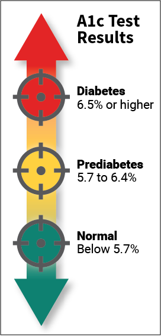

# Type-2-Diabetes-Risk-Prediction
Type 2 diabetes is a chronic condition that affects the way the body metabolizes sugar (glucose). With type 2 diabetes, the body either resists the effects of insulin (a hormone that regulates the movement of sugar into cells) or it doesn't produce enough insulin to maintain normal glucose levels. Type 2 diabetes occurs more commonly in middle-aged and elderly people. Uncontrolled it can cause all sorts of very bad things: infections, damaged kidneys, vision loss and blindness, amputations and many more. So, there is no question that type 2 diabetes needs to be taken seriously and treated. Type 2 diabetes is usually diagnosed using the glycated hemoglobin (A1C) test. This blood test indicates the average blood sugar level for the past two to three months. Normal levels are below 5.7 percent, and a result between 5.7 and 6.4 percent is considered prediabetes. An A1C level of 6.5 percent or higher on two separate tests means you have diabetes.  People who have diabetes need this test regularly to see if their levels are staying within range and if they need to adjust their diabetes medicines. To treat type 2 diabetes lifestyle changes are very effective, and the side effects of eating more healthfully and staying more active are positive ones. In this project I will try to predict A1C levels: no-diabetes, pre-diabetes and diabetes. I will transform the dataset from a regression task (A1C) into a multi-class classification task (3 A1C levels).

